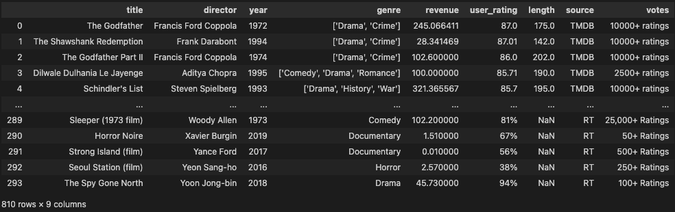
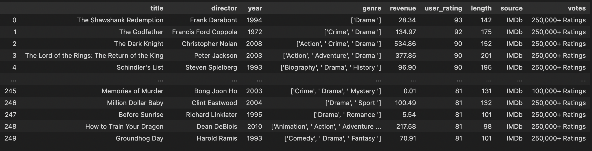
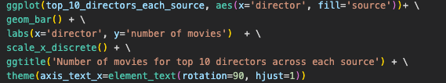
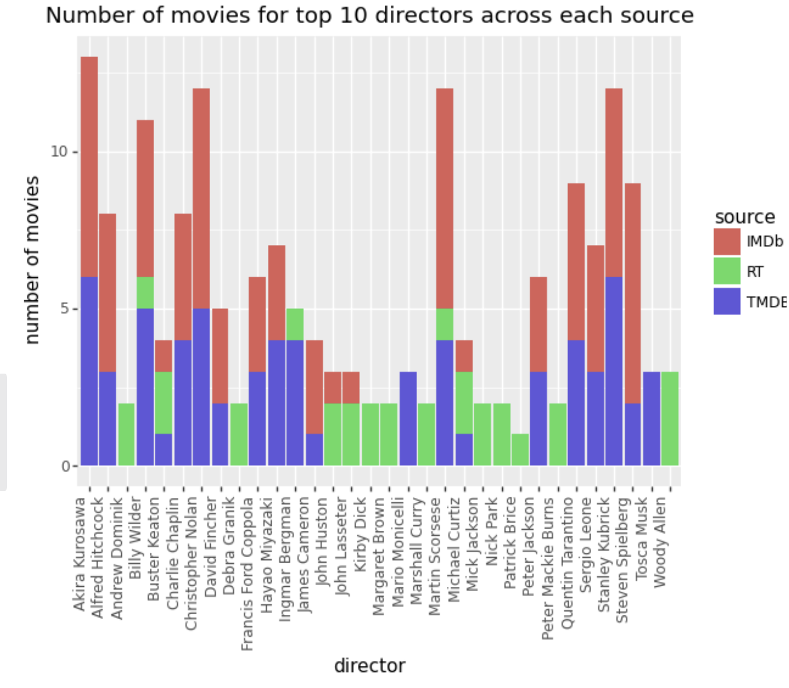
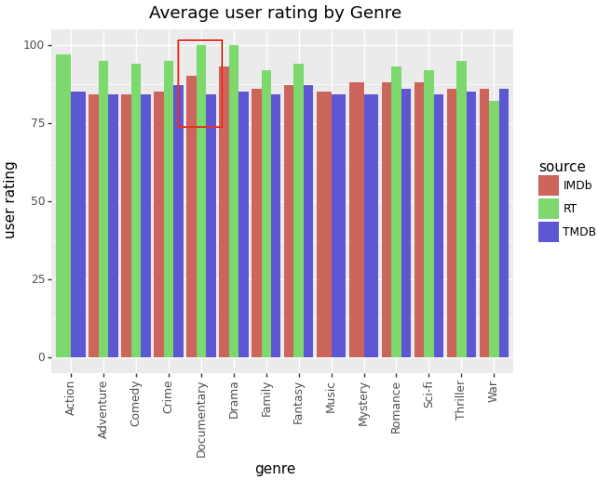
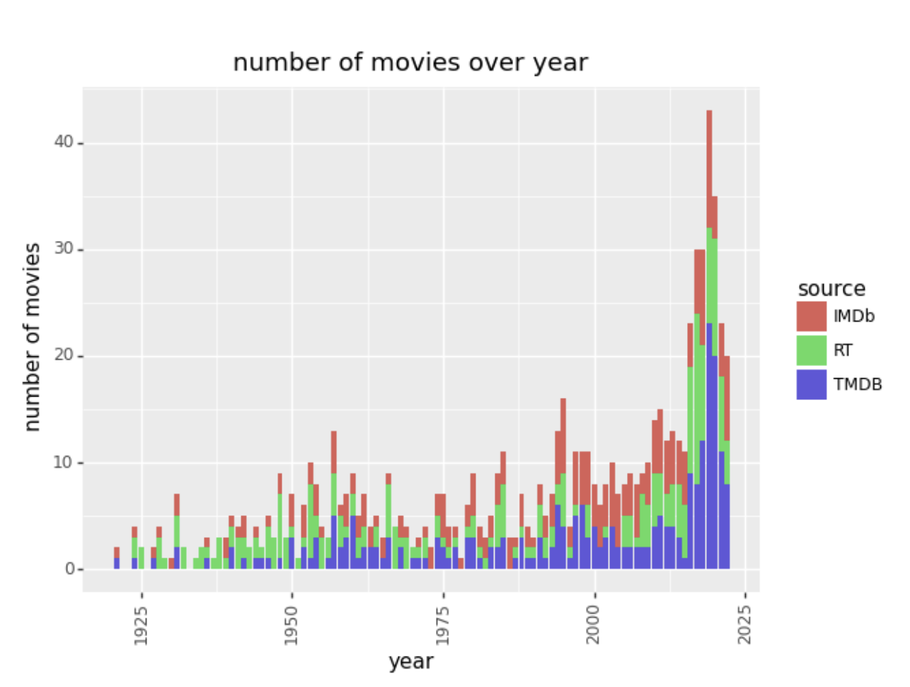

---
# 🎥 Movie Rating Site Analysis
---

*Team members:* 

- [Jackson Quinn]()
- [Shuja Ali]()
- [Jia Jiangan]()

## 📝 Project Description
Finding out the most critical movie review source. We all love watching movies, and we tend to look at reviews when deciding on watching a film to check the quality and see whether it's worth watching. Since there are numerous review sites, we would like to see which review site out of IMDB, TMDB and Rotten Tomatoes would be the most reliable.

## 📊 Data

Collecting data of the top 250 movies from: IMDb, Rotten Tomatoes and TMDB

### TMDB

For TMDB, first the API was used to get the top 250 movies and their IDs. The ID was used to get all the key information of an individual film (e.g., revenue, director) in a json requests format. As numerous films in TMDB had missing revenue values, IMDb was used to fill in the missing values where possible (TMDB API also gave the IMDb ID of each film). Most films had multiple genres and some with multiple directors, so the genres and directors for those films were stored in a list. When we wanted to separate the data by genre or director, we used the pandas df.explode() function to do so.

Data was then compiled in a dataframe. The variables used included: (user) rating, director, revenue, users voted, the data source and the year. 

Rating values were converted into a percentage and votes was converted from a flat number to brackets (since Rotten Tomatoes doesn't have a flat number for the number of users voted), to make the data consistent, so all 3 sites can be easily compared and the dataframes can be concatenated.

### IMDb 

We were able to find a list of the top 1000 movies on IMDb by rating. We then took the first 250 movies from this list to use in our project. IMDb was not willing to let us use their API, so the data was collected using webscraping. We collected the movie title, director, year of release, genre, revenue, rating, length, and number of user votes. We then made the rating out of 100 instead of 10 for the sake of comparability. Initially, we created one IMDb df that had only one genre per movie. Later we put all genres in a list and used df.explode() to separate them when necessary. We also bracketed the votes like we did for our TMDB data for ease of comparison. 

## 📈 Analysis
The analysis is done by concatenating the dataframes for all sources, and using ggplot to assess different variables, such as the rating distribution of the votes in all 3 sources.

## 🖼️ Results

Evidence of biases between directors for TMDB and IMDB. The frequency of directors in Rotten Tomatoes does not exceed 3, whilst directors have appeared up to 7 times in TMDB and IMDB.

Rotten Tomatoes ratings are generally higher than both IMDb and TMDB; Rotten Tomatoes have a greater median rating value, and a higher maximum rating (100) and a higher minimum rating (82). 

Across all movie genres, except for war, Rotten Tomatoes average user rating is higher than our counterparts.

When comparing the number of movies in each source's top 250 movies over the years, there were more number of films as time passed, as we predicted. However, we did note there is a greater number of Rotten Tomatoes movies that were represented in the earlier years, compared to IMDb and TMDB. This may be another reason why there are higher overall ratings for Rotten Tomatoes; earlier films are more highly rated.

## 🖋️ Conclusions

### - In conclusion, we think there is no strong evidence that there is a preference for a genere within or across genres
### - Examining the graph of absolute user ratings over genres over 3 sources, we see that there is no significant pattern of preference for a single genre (as variations are relatively small) & across sources (no pattern across sources)
 
- We also plotted a graph showing representation of movies by genre from a essentially random sample
- While it seems like RT users might have a preference for that Documentary movies, as they are over-represented, the data from absolute user scores and later composite user and composite overall scores suggest otherwise

#### - This points to the fact that there is no preference for genres within or across genres

- However, our data shows support for the hypothesis that IMDb and TMDB are more popular compared to RT
- This is because of three reasons
    - IMDb and TMDB have, on average, a greater representation of higher grossing flims than RT even as their average release year across sources are similar (evidence 1)
    - IMDb and TMDB have, on average, more voters than RT even as their average absolute user rating is about the same (evidence 2)
    - IMDb and TMDB represent a significantly greater proportion of modern flims compared to RT (evidence 3)

### - All these evidences suggest that IMDb and TMDB are more popular sites in modern times than RT. With a greater popularity, more viewers vote (evidence 2), and more viewers review higher grossing flims (evidence 3) than lower ones as higher ones are more popular leading to a higher absolute gap, in the context of the modern era (evidence 3). 

## 📚 References

Wikipedia: "List of films with a 100% rating on Rotten Tomatoes" https://en.wikipedia.org/wiki/List_of_films_with_a_100%25_rating_on_Rotten_Tomatoes
IMDb top 250 movies https://www.imdb.com/chart/top/
TMDB API https://developer.themoviedb.org/docs
