---
# 🎥 Differences in Movie Rating Sites
---

*Team members:* 
- [Jackson Quinn]()
- [Shuja Ali]()
- [Jia-Jian Gan]()

## 📝 Project Description

Everyone in our group loves watching movies, and we tend to look at reviews when deciding on watching a film to check the quality and see whether it's worth watching. Since there are numerous review sites, with each having their own differing opinion on many films, we would like to examine the differences in user preference between the sources. We would also like to examine the popularity of the sources and how it affects the preferences of their respective users. Uncovering these preferences will better allow us to interpret movie ratings on these websites.

Our project includes the usage of data science techniques, to collect, store, clean, and plot the data to conduct analysis.

A flow chart outlining our project plan:

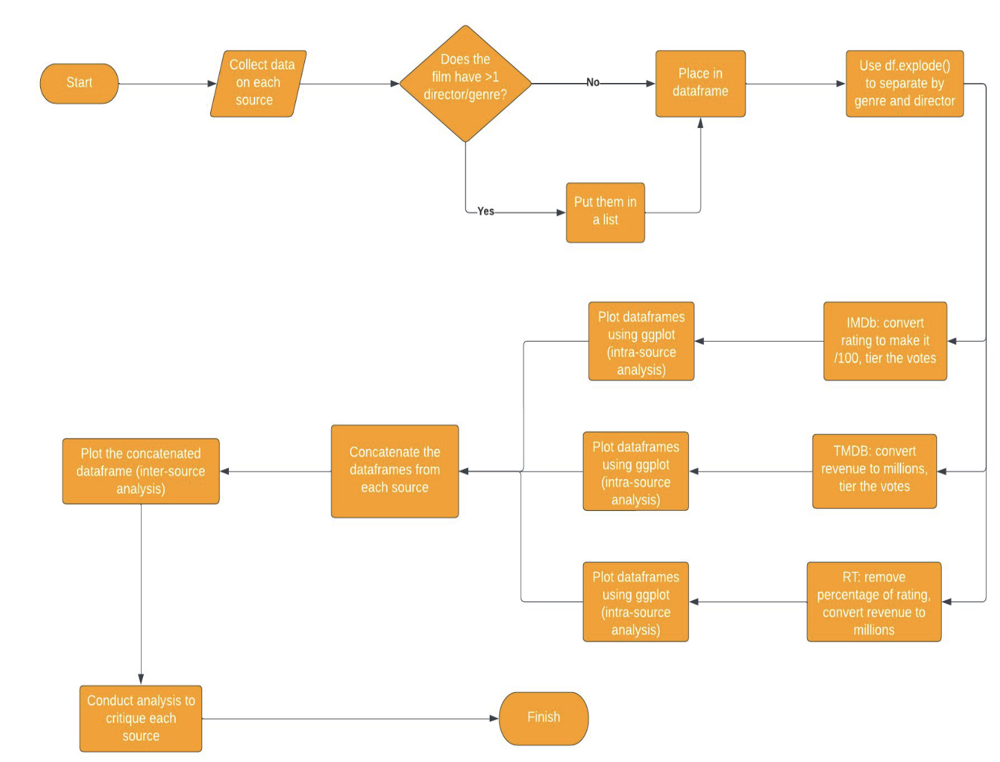

To make our analysis more advanced and critical, we designed a composite score for each movie. The composite score consists of 4 factors: the user rating, the number of users voted, the revenue, and the year. The purpose of this is to level off our data and provide a more layered analysis.

## 📊 Data

Collecting data of the top 250 movies from: IMDb, Rotten Tomatoes, and TMDB

| Data Source | Challenges |
| -------- | -------- |
| Wikipedia   | Lack of data which forced us to cross-reference another site like Rotten Tomatoes   |
| Rotten Tomatoes   | Ensuring homogeneity with other sources as RT has a large international presence, so filtering for just US films required extra steps  |
| IMDb   | Homogenizing data with the other sources (bracketing votes, putting rating out of 100)   |
| TMDB   | Missing revenue values for several films   |

### Wikipedia/ Rotten Tomatoes (RT)

For Rotten Tomatoes, our approach was to leverage data from a Wikipedia article featuring films with 100% ratings. We initially gathered a larger pool of 424 films and later refined it to our target 250, keeping in mind that these ratings did not equate to 100% user ratings.

To facilitate data analysis and maintain consistency with the other data sources, we had to perform several data cleaning steps. This included the standardization of revenue and movie runtimes, and the transformation of the number of votes into brackets.

We also developed a composite score for each movie, which was calculated considering both user ratings and revenue. Additionally, we tried to score directors based on the average composite scores of their movies and their number of films in the list. However, after feedback, we decided to focus more on comparing sources than analyzing individual directors.

Data was then compiled in a dataframe with key features including the rating, director, revenue, users voted, the data source, and the year. All features were adjusted to match the format and data types used by our teammates for IMDb and TMDB data, ensuring a seamless concatenation process.

##### Data Collection Challenges

The most significant challenge we encountered with Rotten Tomatoes data was ensuring homogeneity and comparability with other sources. This is because RT has a large international presence, so it was especially tricky when dealing with different currencies in revenue and trying to remove non-US films.

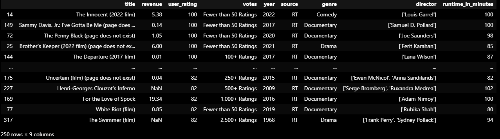

### TMDB

For TMDB, first the API was used to get the top 250 movies and their IDs. The ID was used to get all the key information of an individual film (e.g., revenue, director) in a JSON requests format. As numerous films in TMDB had missing revenue values, IMDb was used to fill in the missing values where possible (TMDB API also gave the IMDb ID of each film). Most films had multiple genres and some with multiple directors, so the genres and directors for those films were stored in a list. When we wanted to separate the data by genre or director, we used the pandas `df.explode()` function to do so.

Data was then compiled in a dataframe. The variables used included: (user) rating, director, revenue, users voted, the data source, and the year. 

Rating values were converted into a percentage and votes were converted from a flat number to brackets (since Rotten Tomatoes doesn't have a flat number for the number of users voted), to make the data consistent, so all 3 sites can be easily compared and the dataframes can be concatenated.

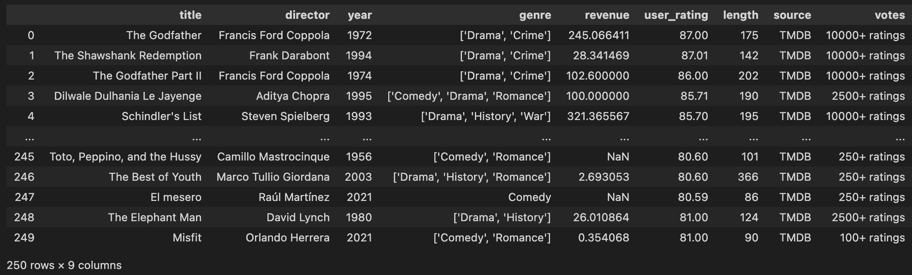

### IMDb

We were able to find a list of the top 1000 movies on IMDb by rating. We then took the first 250 movies from this list to use in our project. IMDb was not willing to let us use their API, so the data was collected using web scraping. We collected the movie title, director, year of release, genre, revenue, rating, length, and number of user votes. We then made the rating out of 100 instead of 10 for the sake of comparability. Initially, we created one IMDb dataframe that had only one genre per movie. Later we put all genres in a list and used `df.explode()` to separate them when necessary. We also bracketed the votes like we did for our TMDB data for ease of comparison. 

    
<h2>📈 Analysis & 🖼️ Results</h2>

    
<h2>Section 0: Preliminary analysis (unrelated to later sections)</h2>

(Our analysis and results section are merged as we felt showing and analyzing each step of our data analysis process for clarity)
 
Before we begin, we will show a sample of how we created our analysis by using ggplot(shown below).
    

---

### Now, we will show some preliminary data analysis that is unrelated to sections I, II, and III.

- While doing some exploratory analysis, we produced the following graph. On the x-axis, we have the different vote brackets, and on the y-axis, we have the average revenue of each interval.

- One would think that as the number of votes increases, the revenue would as well because we expect a positive correlation between the number of votes and the number of people who have seen the movie. And so, the more people who have seen a movie, the higher that movie’s revenue. We kind of see this trend in the graph, although there is a huge spike in revenue for the 10,000 and 25,000 votes intervals. We were curious about this, so we looked for outliers. After sorting the concatenated dataframe by revenue, we found this.

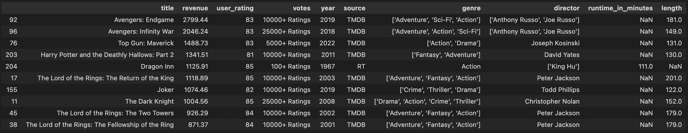

- Both the 10,000 and 25,000 votes intervals have an Avengers movie with very high revenue relative to other movies, which is pushing the average revenues for these movies higher. 

---

 
There seems to be movies from a greater variety of directors in RT. The frequency of directors in Rotten Tomatoes does not exceed 3, whilst directors have appeared up to 7 times in TMDB and IMDb.
          
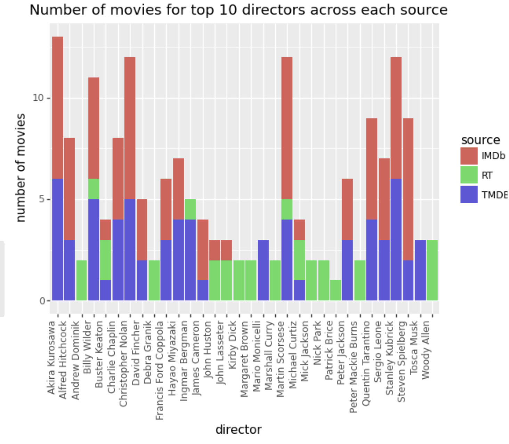

TMDB's top 250 movies have by far the greatest average revenue, with Rotten Tomatoes with the least. This suggests TMDB users have a preference towards more popular films, whilst Rotten Tomatoes users do not.      
 
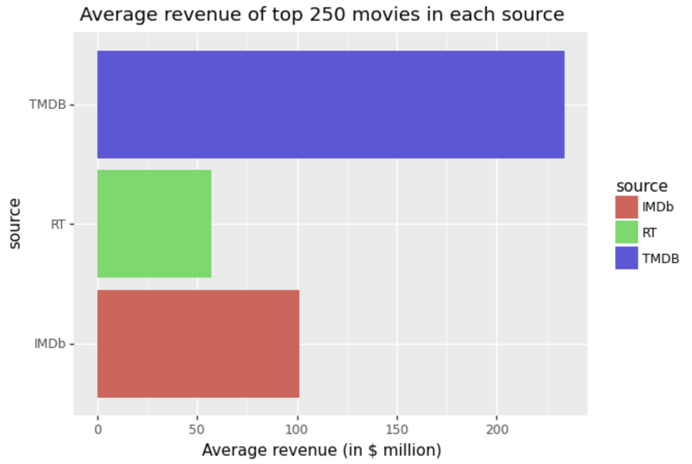
          
This suggests TMDB and IMDb users may be biased towards films with a specific director or a higher box office, however, the analysis is preliminary, and more analysis needs to be conducted to make a conclusion.
      
## So far, we have seen how outliers have skewed the average revenue of voting intervals, the variation in the number of directors included in the top 250 movies from each source, and the (large) variation in the average revenue per movie across our three sources.
      

    
<h2>Section I: Is there a preference for certain genres according to sources, as examined by absolute user ratings and absolute representation?</h2>

- In Part I, we tried to see if we can infer anything from the graphs of average absolute user rating by genre across 3 sources

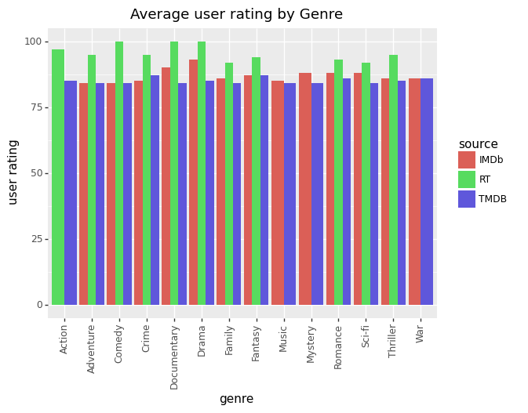

- We saw that RT users tend to vote more optimistically compared to IMDb and TMDB on average
- However, we find no substantial differences/preferences for 1 genre relative to the other within genres by eyeballing the data and seeing how any differences are not consistent across sources, and were minimal fluctuations at best (relative to total ratings)

- Still in part I, we also plotted a graph of the number of top movies by genres so we can see if a source gives "preferential" treatment to those from a different source

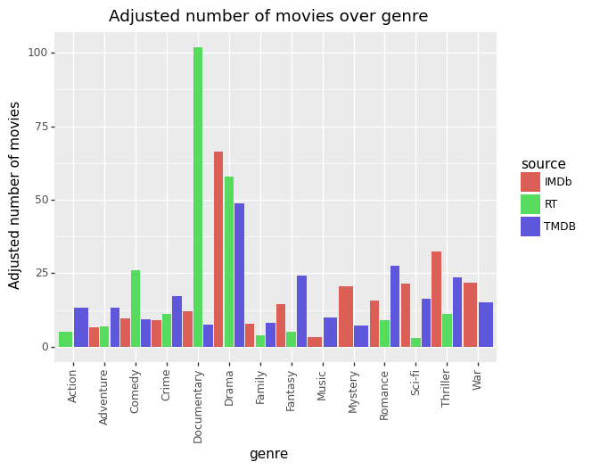

#### As we saw from the adjusted graph, there seems to be a HUGE representation of Documentary-type movies for just Rotten Tomatoes!
- After doing some adjustment, we found that there are a lot of Drama movies across all sources (most for IMDb and TMDB, and 2nd for RT)
- Potential inference might mean that, on average, many people like Drama-type movies!
- However, there might be other confounding variables, like maybe there are just a greater proportion of Drama movies made, so naturally more are highly rated
- We can also see that RT does not have movies in certain genres like War, Mystery, or Music! However, this is due to the fact that there aren't categories for this on RT
- No clear relationship for other genres

## In conclusion, data from user ratings suggest no preference for a certain genre across sources. However, data from the representation of top movies seems to indicate a potential preference for Documentary genres within RT. However, as we would soon find out in section 2, this isn't the case!

    
<h2>Section II: Examining differences in composite scores to see if there are any discrepancies or patterns in absolute user score, number of voters, absolute revenue, and date of release in order to derive conclusions about the sources</h2>

- First, we began by calculating the overall composite score

The composite score = function(User composite score, revenue composite score)

- User composite score = function(absolute user rating, number of users)
- Revenue composite score = function(revenue at the time of release, year of release) 

- Hence, the composite score consists of 4 components:
  - User score
  - Number of users who rated
  - Revenue
  - Date of release (revenue was scaled up due to inflation)

We then plot a graph of the average overall composite movie score over genre with 3 bar graphs for each data source

- We again find no clear pattern of composite scores within genres
- Even the Documentary genre for RT isn't higher than the rest despite over-representation shown earlier
- This points to other factors causing over-representation besides the hypothesis that RT users like Documentaries
- This gives evidence to refute our initial findings in section 1, that there might be a slight preference for Documentary genres within Rotten Tomatoes sources
- However, we find crucial data (indicated in the graph or a more condensed one below) that RT has the lowest average overall score across all genres followed by TMDB and IMDb.

We then tried to find out which of the 4 components contribute to this trend by sketching appropriate graphs
- By plotting a graph of average revenue score over genre with 3 bar graphs for each data source among other things, we can see that RT is the lowest, followed by TMDB and IMDb. This matches the earlier pattern, so revenue explains it!

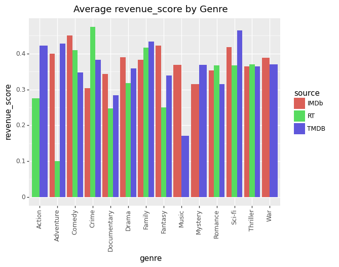

(Graph helps to explain as there are similar "peaks" and troughs as compared to the total composite score graph)

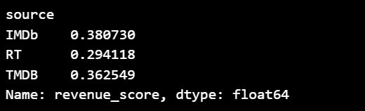

(This mean table gives a simpler version of analysis to prove what we're saying above)

- Since revenue composite score is made up of revenue at the time of release (Absolute revenue) and year of release, we did further analysis via graphs to see which factor exactly contributes to this trend
        
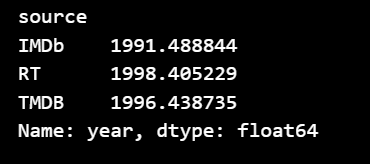

- From the data (above), we can see that the years are clearly not a factor. The order is reversed, and differences are minimal

**This means the differences are primarily attributed to absolute revenue!**

**In other words, while it seems that there is no preference (or conflicting evidence) as to whether there are preferences between genres within or between sources, our data seems to suggest that movies with higher absolute revenue are over-represented in IMDb and TMDB relative to Rotten Tomatoes!**

**A possible explanation could be that IMDb and TMDB are more popular sites than Rotten Tomatoes. Hence, movies with higher revenues (and hence more overall customers) visit sites like IMDb and TMDB more relative to RT! (Obviously, this is just a hypothesis. Correlation does not imply causation)**

We next examined the user composite score and see the same pattern of (RT -> TMDB -> IMDb) for the user composite score

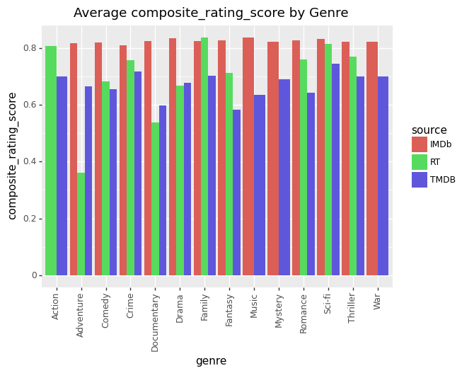

(Graph showing composite user score)

(Table showing mean user score)

- However, the data/graph seems to only partially confirm this as only some patterns are explained but not others in the graph
- **Taken together, it seems that the composite user rating score only partially explains the lower average total score for RT but doesn't explain to the same extent as revenue composite!**
- This is because while the means follow the same pattern, the "peaks" and "troughs" of the data from the user composite don't follow the same pattern as the overall composite!

We next analyzed the data to see which of the 2 components in the user composite (user rating or number of voters) contributes to the trend

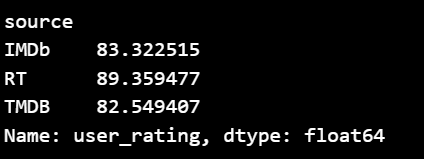

- The data seems to clearly show that absolute ratings aren't the reason contributing to the composite user rating order between sources as the order there doesn't match the order previously (instead of RT being lowest and IMDb being highest, now RT is highest)
- **Instead, it seems like the number of voters is the major reason!**
- **It seems that it is the number of voters & absolute revenue that explains the trend we see in composite user rating and overall composite score**

**To summarize, while it seems that there is no preference (or conflicting evidence) as to whether there are preferences between genres within or between sources, our data seems to suggest that movies with higher absolute revenue are over-represented in IMDb and TMDB relative to Rotten Tomatoes! Hence, this supports the idea that IMDb and TMDB are more popular sites than Rotten Tomatoes! If IMDb and TMDB are more popular, those sites would get more voters for popular movies. Indeed, this is what we see!**

    
<h2>Section III: Appendix/Section 3: Even more evidence to support the popularity of IMDb and TMDB compared to RT</h2>

- We plot a graph of the number of movies over their release date

- The graph clearly shows that there is a significant over-representation of RT movies in pre-modern times and under-representation in modern times

**Perhaps this points to the fact that IMDb and TMDB are more popular in recent times compared to RT!**

    
    

    
<h2>🖋️ Conclusion</h2>

- In conclusion, we think there is no strong evidence that there is a preference for a genre within or across sources
- Examining the graph of absolute user ratings over genres over 3 sources, we see that there is no significant pattern of preference for a single genre within sources (as variations are relatively small) and across sources (no pattern across sources)
- We also plotted a graph showing the representation of movies by genre from an essentially random sample (we collected data using a similar approach for all 3 - collecting data from top movies as indicated by the source itself)
- While it seems like RT users might have a preference for that Documentary movies, as they are over-represented, the data from absolute user scores and later composite user and composite overall scores suggest otherwise

#### This points to the fact that there is no preference for genres within or across sources

- However, our data shows support for the hypothesis that IMDb and TMDB are more popular compared to RT
- This is because of three reasons:
  - IMDb and TMDB have, on average, a greater representation of higher-grossing films than RT even as their average release year across sources are similar (evidence 1)
  - IMDb and TMDB have, on average, more voters than RT even as their average absolute user rating is about the same (evidence 2)
  - IMDb and TMDB represent a significantly greater proportion of modern films compared to RT (evidence 3)

### All this evidence suggests that IMDb and TMDB are more popular sites in modern times than RT. With greater popularity, more viewers vote (evidence 2). Moreover, as movies with higher revenues are the ones that attract more customers, more popular sites will have more traffic to those movies, leading to them being over-represented as top movies in IMDb and TMDB (evidence 1). The relative popularity of IMDb and TMDB also seems to be validated especially in the modern era, as traffic for modern movies for RT is lower compared to IMDb and TMDB, leading to IMDb and TMDB representing a greater % of higher-performing films compared to RT (evidence 3). 

    
<h2>📚 References</h2>

Wikipedia: "List of films with a 100% rating on Rotten Tomatoes" 
 
https://en.wikipedia.org/wiki/List_of_films_with_a_100%25_rating_on_Rotten_Tomatoes
 
Rotten Tomatoes
 
https://www.rottentomatoes.com/
 
IMDb top 250 movies 
 
https://www.imdb.com/chart/top/
 
TMDB API 
 
https://developer.themoviedb.org/docs
        

